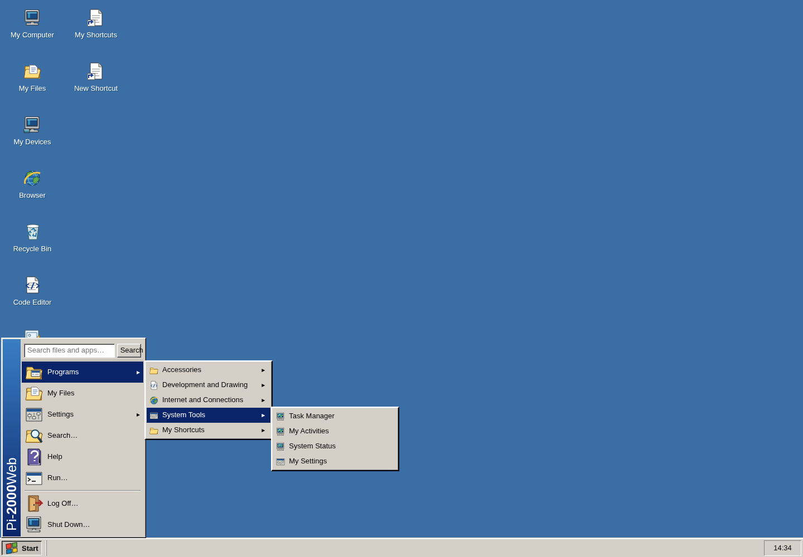

# Pi-2000Web

**Alpha software.** A personal web desktop for Raspberry Pi 5, inspired by the look and interaction patterns of Windows 2000. It provides private user accounts, persistent SSH terminals, a streamed Chromium browser, file storage, a code editor and everyday desktop tools.

Pi-2000Web uses **Python** (aiohttp, AsyncSSH and SQLite) on the server and **plain JavaScript, HTML and CSS** in the browser. It does not require React or a separate database server. The desktop interface and project documentation are in English.

This is an independent project, not a Microsoft product and not a Windows emulator. The Chromium browser runs on the server; external websites retain their own appearance and language.

## Applications

| Application | Features |
| --- | --- |
| My Files and Desktop | Private files and folders, upload by drag and drop, folder uploads, rename, move, copy/paste, download and ZIP export. Drag desktop icons to arrange them. |
| Recycle Bin | Restore deleted files, folders and shortcuts, or delete them permanently. |
| My Devices | Organise SSH connection profiles in folders; verify host keys and connect to remote devices. |
| Browser | Persistent Chromium tabs, separate cookies and profiles for each account, audio, automatic resizing and an enforced uBlock Origin Lite policy. |
| Code Editor | Local Ace editor with syntax highlighting, tabs, completion, find/replace, undo/redo, word wrap, themes, file trees, recovery drafts and SFTP editing. |
| Dimension Drawing | Dimensioned 2D shapes, rotated cutouts, frame and hole patterns, approximate clearance/collision checks, private saved drawings, SVG and CSV export. |
| Calculator | Arithmetic, parentheses, powers, scientific functions, memory buttons and session history. Trigonometry uses degrees. |
| Notes and Tasks | Private notes and checklists with automatic saving. |
| Search and Favourites | Search private files, folders, applications and connections; save favourites and revisit recent items. |
| SFTP – File Transfer | Transfer saved files between My Files and an SSH device; create remote folders. |
| My Activities | Reopen terminals, inspect transfers, switch windows and end your own sessions. |
| Task Manager | Applications, processes, CPU/RAM graphs, per-core graphs, uptime, swap, private storage quota and server disk space. |
| My Settings | Desktop text size, default text viewer, background, password and signed-in sessions. |
| User Management | Owner/admin account management, account activation and storage quotas. |

Start → Programs groups applications into **Accessories**, **Development and Drawing**, **Internet and Connections**, **System Tools** and **My Shortcuts**. The common File, Edit, View, Connection and Help menus expose the commands relevant to each application.



See [the user guide](docs/HELP.md) and [the design rules](docs/DESIGN-RULES.md).

## Accounts and private storage

The protected initial account is `admin` and owns the installation. The owner can promote a regular user to administrator or demote an administrator. Administrators can manage regular users; only the owner can manage other administrators or change roles. The owner cannot be deleted, disabled or demoted.

Each account has its own connections, verified SSH host keys, files, desktop settings, browser profile, notes, drafts, favourites and recent items. New accounts receive **50 MiB** of file storage. Administrators can increase a regular user quota; only the owner can change another administrator quota. Quotas include files on the desktop, items in the Recycle Bin, notes, drawings, editor drafts and upload reservations. Browser profiles and backups are outside this quota.

Passwords contain 12–1024 characters and are stored as salted scrypt hashes. The initial random password is written to `/var/lib/win2k-admin/initial-password.txt`, readable only by root/the service account. Change it using Start → Settings → Change Password; changing it removes the initial-password file. Usernames contain 3–64 letters a–z, digits, dots, hyphens or underscores and are unique without regard to case.

Disabling/deleting an account, administrative password resets and role changes revoke its existing logins and running sessions. Changing your own password preserves the current login while revoking other logins. Web login sessions expire after at most twelve hours. Token digests, rather than raw session tokens, are stored in SQLite.

## Persistent work

SSH jobs run in the separate `win2k-sessions` service. Disconnecting your computer, reloading the page or logging off disconnects the display; the job can continue on the server. Logging in again restores the saved workspace and reconnects to available sessions. Up to eight terminal sessions per account are supported, including ended sessions retaining output.

Use My Activities or Task Manager to end a terminal explicitly. A terminal window can also ask for confirmation before ending its SSH session. Browser windows preserve their browser session when closed; Connection → End Session stops it. A browser with no connected client is stopped after 24 hours.

**Persistence depends on the Pi and the remote device continuing to run.** Restarting the session service, rebooting the Pi, losing power on the Pi or losing the remote SSH connection can end jobs. This is not a checkpoint/restart system. Frontend updates intentionally preserve the running session worker.

## Deployment and Raspberry Pi 5

The current installation has been exercised on a Raspberry Pi 5 with a **64-bit Debian 13 / Raspberry Pi OS environment**, systemd and Caddy. A complete clean-machine installation walkthrough will be validated before the first public Alpha release. The existing maintenance scripts assume the service account, application virtual environment and Caddy installation already exist; **they are not yet a one-command fresh installer**.

See [deployment and database notes](docs/INSTALLATION.md) for the current layout, database initialisation and maintenance commands. Do not copy a production database, private keys, browser profiles or backup archives into a source repository.

Internal service names, environment variables, JavaScript namespaces and paths retain the legacy `win2k` identifier for compatibility. The product name is **Pi-2000Web**. Renaming the source checkout does not rename or migrate stored data. Scripts locate the checkout relative to their own location.

## Browser and resource limits

Chromium runs inside a bubblewrap sandbox with a private display, audio service and per-account home directory. Selkies streams it through an authenticated proxy and Unix sockets. No public remote-debugging or browser-streaming port is required. Tabs, cookies and website logins are isolated per account. Modern JavaScript is supported; legacy Java browser plug-ins are not supported by Chromium. Audio may require a click inside the browser.

There are three simultaneous browser sessions globally. Each browser has CPU and process limits (1.5 CPU cores and 256 processes). The configured memory target is 1.5 GB. On the reviewed host, memory cgroups were disabled, so a watchdog provides a **soft**, rather than hard, memory limit. Low-disk checks are also global. See the [security review](docs/security/review-2026-09-08.md) for remaining network and resource isolation limitations.

## Files, editor and SFTP details

Uploads are streamed with quota reservations and current-session validation. File content is stored separately from SQLite metadata. Text saves use content versions and immutable replacement blobs; if the file has changed, save as a new file to preserve your edits. ZIP downloads support up to 1,000 items or 50 MB at a time. Accounts have a maximum of 5,000 file/folder objects and 5,000 connection/folder objects.

Code Editor supports UTF-8 text up to 1 MB per file and up to 100 tabs. Ctrl+S saves the active file. Recovery drafts are saved privately on the server and count towards the quota; they do not replace explicit file saves. Closing/logging off warns if draft saving fails. The default new file name is `untitled.txt`.

Connection → SFTP – Open Device opens the remote file tree using one of your own SSH profiles. SSH passwords remain in memory and must be entered again after a reload. Unknown SSH host keys require fingerprint verification; changed keys are rejected. SFTP tabs save to the connected device. Save As creates a local file; Save Copy on Device creates a new remote file without replacing an existing file.

Remote saves check the file hash, write an exclusive temporary file and rename it into place, preserving ownership and mode or failing safely. Conflicts leave your editor contents intact. Symbolic links are resolved on open and rejected as save targets. Remote hash-check plus rename is not an atomic compare-and-swap against unrelated external writers; a narrow race remains. ACLs, extended attributes and hard-link relationships are not preserved by replacement saves.

SFTP transfers support up to 50 MB per file, two simultaneous operations per account and a timeout. They require the page to remain open. Remote editing supports up to 1 MB of UTF-8 text.

## Drawing and calculations

Dimension Drawing supports rectangles, squares, circles, ellipses, three-sided triangles, right triangles, trapezoids, regular polygons with 3–12 sides and slots. Cutouts use the same shapes, with centre coordinates and rotation. Frame width applies to rectangles, squares and circles. Drawings use millimetres with origin (0,0) at the bottom left of the outer bounding box.

Curves are approximated by polygons for collision/clearance checks; the displayed tolerance describes that approximation. Areas use shape formulae, and net area is withheld for invalid or overlapping cutouts. These drawings are dimension-planning aids, not certified manufacturing output. Save stores the drawing for your account; SVG and CSV export create local downloads. Existing older rectangle/hole drawings are migrated when opened.

Calculator uses a bounded arithmetic parser without `eval`. Functions include `sqrt`, `abs`, `sin`, `cos`, `tan`, `asin`, `acos`, `atan`, `log` and `ln`, with `pi` and `e`. Decimal points and commas are accepted. `%` divides the complete expression by 100. Calculator memory/history belongs to the open window.

## Task Manager

Open Start → Programs → System Tools → Task Manager, right-click the taskbar, or press Ctrl+Shift+Esc. Performance samples are requested every two seconds and the open window keeps 120 seconds of history. Pause/resume and per-core graphs are available from View.

CPU, RAM, swap and physical disk figures describe the **Pi server**, not the computer displaying the page. CPU percentages use total server capacity. Used RAM is total minus available memory. Process RSS includes shared memory and should not be summed into total RAM usage. Physical disk figures include reserved space separately from space available to the service.

Regular users and added administrators see only their own browser process details. Only the owner can select all server processes. No command lines, environment variables or process paths are exposed. Individual operating-system processes cannot be terminated through this API. Applications lists your own windows and terminal sessions; closing an editor respects its unsaved-work checks. SSH commands execute on the connected device, so those remote processes are not server processes.

## Backups and security

The nightly backup timer creates verified local snapshots containing the SQLite database, file blobs and browser profiles. Seven backups are retained under `/var/backups/win2k`. Browser processes are briefly frozen for a consistent filesystem snapshot. Restores are staged and validated before replacing data. Backups on the same disk do not protect against disk failure; an off-device backup plan remains necessary.

The desktop uses an authenticated Python API, secure session cookies, Origin checks, bounded login/password work, per-account access checks and a Content Security Policy. Caddy administration uses a private Unix socket. The reviewed browser sandbox still shares the host network namespace, and SSH profiles can reach internal hosts. The project is not yet intended as unrestricted hosting for untrusted tenants.

Read the dated [security findings and verification](docs/security/review-2026-09-08.md). Dependency audit JSON files record checks at that time; they are not a continuing guarantee of package safety.

## Development and tests

```sh
python3 -m venv .venv
.venv/bin/pip install -r server/requirements.txt
.venv/bin/python -m unittest discover -s tests -v
node tests/cad_geometry.cjs
node tests/sketch_geometry.cjs
```

Browser tests use Playwright and `/usr/bin/chromium` against the disposable loopback fixture `tests/ui_server.py` on port 18765. Its test password and temporary database are for tests only. `tests/run_classic_suite.py` starts a fresh fixture per regression and currently expects Playwright under `/tmp/win2k-browser-check/node_modules`.

Main source areas:

| Path | Purpose |
| --- | --- |
| `index.html`, `assets/` | Desktop shell, application UI and shared classic styling |
| `server/app.py` | Authentication, accounts, connections, workspace and API routing |
| `server/file_store.py`, `server/personal_store.py` | Private files, quotas, notes, drawings and drafts |
| `server/session_store.py`, `server/session_proxy.py` | Shared login sessions and persistent-worker transport |
| `server/browser_*.py`, `server/resource_limits.py` | Browser sandbox, display, streaming and resource limits |
| `server/sftp_tools.py` | Remote transfer and editor operations |
| `server/task_monitor.py` | Read-only Linux resource monitoring |
| `server/backup.py`, `scripts/` | Backup, deployment and maintenance |
| `tests/` | Backend integration, geometry and browser regressions |

## Design origins and third-party components

The starting design was extracted from `https://github.com/xhonken/matchpuls`, commit `921fc4c345a3ca8f69cdf8b708210bae91dcee2a` (2026-09-07). `reference/gallery/` is an archived upstream design reference, including its original text and examples; it is not installed as part of Pi-2000Web. The maintained standalone example is under `examples/standalone/`.

The current desktop has original code-drawn SVG icons generated by `scripts/build-classic-icons.py`. Historical Windows screenshots were used as visual references, not copied into the application. See [UI reference notes](docs/design/windows-2000-ui.md).

Vendored Ace, xterm.js and PDF.js retain their upstream licence files. Browser dependency revisions are recorded under `server/`. A project-wide distribution licence and clean-install release packaging must be settled before public release.
