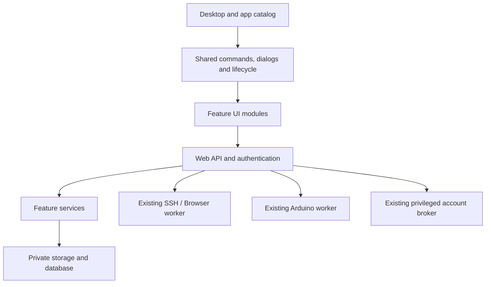

# Architecture and maintainability review — 2026-09-14

Review baseline: source commit `a12c7ad77a6b`. This document records findings and a proposed migration plan. It does not implement the proposed refactoring.

## Follow-up fixes

The subsequent bug-fix change scopes the CAD-only Object command to Dimension Drawing (R4) and checks/installs missing declared system packages during source updates (R2). The broader architectural proposals remain pending.

## Assessment

Pi-2000 should evolve as a modular application while retaining its Python/aiohttp backend, plain JavaScript frontend, classic desktop and existing process boundaries. The useful next step is to make dependencies and contracts explicit. Splitting files into folders alone would leave the current coupling intact and would break parts of deployment.

The existing Browser runtime, resource limits, file store, session store, account broker, database transfer and drawing geometry components provide useful starting points. Preserve their ownership and security rules. Keep the existing process separation for persistent SSH/Browser work, Arduino execution and privileged account operations.

## Scope and evidence

Inventoried tracked first-party server, frontend, installation, packaging and test code; inspected application registration, API wiring, authentication/ownership, storage and schema initialization, worker lifecycle, backup/restore selection, source/package deployment, representative feature handlers and browser test orchestration. Archived design references and vendored libraries were excluded from size measurements. This is an architecture review, not a line-by-line security audit or a load test.

| Area | Code files | Physical lines | Source bytes |
| --- | ---: | ---: | ---: |
| Server Python | 29 | 5,302 | 314,484 |
| First-party frontend JS/CSS | 34 | 2,716 | 488,368 |
| Installation/build scripts | 17 | 818 | 51,003 |
| Packaging Python | 2 | 270 | 16,881 |
| Tests/helpers | 64 | 3,923 | 332,430 |

The count includes `.py`, `.js`, `.cjs`, `.sh` and `.css` in those directories; unit definitions, extensionless package hooks and HTML are inspected separately, not counted in the table.

Validation during this review:

- Fresh full backend run: **120 tests passed** in 31.831 seconds.
- Disposable Chromium/UI reproduction confirmed an enabled CAD-only command in Display Studio with no matching control.
- Read-only service inspection found the web API, session worker and Arduino worker active. No production code was installed and no production service was restarted for this review.
- Browser menu reproduction used an isolated loopback server, temporary database and test account. No production user content was used.

## Findings, in priority order

### R1 — Installation and backup currently assume flat Python files

**Priority: high; prerequisite for package directories.**

Evidence: `scripts/publish-server.sh:5` copies `server/*.py`; `scripts/build-deb.py:56` packages the same top-level glob; `scripts/setup.py:277` verifies only top-level Python files. `server/backup.py:120` includes top-level code files and two named directories, so arbitrary new Python package directories would be omitted from code backup.

Impact: moving a module to `server/core/` or `server/features/` could work in the checkout but fail after installation, disappear from a package or be missing from a restore. Frontend publication also uses an explicit long file list in `scripts/publish-local.sh:5`, whereas the Debian builder copies tracked asset trees.

Recommendation: introduce one explicit deployment manifest shared by source installation, package building, verification and code backup. Allow package directories recursively, but exclude virtual environments, caches, private notes, credentials and runtime data. Stage and verify a complete file set before activation. Preserve existing executable entrypoints and sandbox-mounted paths during the migration.

Acceptance: a temporary nested Python package and nested JS module survive source staging, package staging and verified backup/restore; the same fixture proves private files are excluded. Tests must not publish the fixture to the live desktop.

### R2 — Updating source can leave new OS dependencies missing

**Priority: high for dependable upgrades; confirmed conditional behavior.**

Evidence: `scripts/setup.py:335` installs `BASE_PACKAGES` only when `args.command == 'install'`. `update` publishes newer code without reconciling that list. The recently added `iputils-ping` is a concrete example. This host already has ping; a missing dependency on another installation has not been reproduced on physical hardware here.

Impact: a source update may complete while a newly added feature reports that a required executable is absent. Current verification does not exercise every feature dependency.

Recommendation: share dependency declarations between installation and update, check required executables/packages in preflight and install missing declared dependencies within the authorized update. Keep Browser's separately pinned runtime checks. Add an upgrade fixture with a deliberately absent new dependency.

### R3 — On-disk build identity does not prove which worker code is running

**Priority: high for safe maintenance.**

Evidence: `scripts/publish-server.sh` copies new code, starts already-running workers without restarting them and restarts the main API. This intentionally preserves jobs. `scripts/setup.py:verify` checks files and active services; `/api/version` in `server/app.py:960` reports installed build metadata. Neither proves the revision loaded by the persistent session or Arduino worker.

Impact: files and About can describe the new build while a worker continues to execute older code. This is supported by the update design, not evidence of a current service failure. A future incompatible request or schema change could break a mixed-version deployment.

Recommendation: each process should capture its build/protocol identity at startup and report it through an internal health contract. Show installed and running versions separately. Add an explicit pending-update state, stop accepting new work when draining, and restart only after that worker is idle or during an authorized maintenance window. Preserve cross-version API compatibility until activation is complete; do not silently restart active jobs.

Acceptance: start an old worker, install newer files in a fixture and verify the mismatch remains visible until the process is restarted. Confirm active terminal/Browser sessions remain available during compatible API updates.

### R4 — Menu behavior is coupled to text and leaks between applications

**Priority: medium; one UI defect reproduced.**

Evidence: `assets/classic-ui.js:71` finds commands by `data-ui-label` or button text; line 72 invokes the found button. The unconditional `Object` branch at line 82 appends **Outer Shape and Dimensions** to any Object menu. Display Studio has an Object menu but no `[name=outertype]` control. The enabled command was reproduced in Chromium and does nothing there.

Impact: renaming a label, duplicating a button caption or adding a similarly named menu can affect behavior in another app. The shared adapter already contains multiple application-specific cases.

Recommendation: first scope that CAD command to `cad-window`. Then introduce stable command IDs with `execute`, `canExecute`, optional checked state, display label and keyboard shortcut. Menus and toolbars should call the same command object. Retain the label adapter temporarily for apps not yet migrated; do not change every app in one patch.

Acceptance: every enabled menu action has an executable app-owned command; changing a label does not change behavior; Display Studio and Dimension Drawing have independent Object menus; keyboard/disabled-state tests still pass.

### R5 — App definitions are repeated across several central files

**Priority: medium; main source of feature-registration work.**

Evidence: lifecycle registration in `assets/apps.js`, desktop markup in `index.html`, Start entries in `assets/desktop.js`, search catalog in `assets/tools.js`, icon/menu/help maps in `assets/classic-ui.js`, and workspace type validation in `server/app.py:648` all need coordinated edits. `assets/devices.js` also owns authentication, the window manager and workspace restoration as well as device functionality.

Recommendation: expand the existing lifecycle registry into a built-in app catalog with stable ID, window type, title, icon, category, capability requirements, desktop visibility and loader/restore handler. Derive frontend navigation and search from that catalog. Keep a separate server-validated list of permitted workspace descriptors, or generate it at build time from trusted metadata. A frontend registry must never determine server authorization. Preserve current IDs so existing desktop positions, favorites and saved workspaces keep working.

Use this as an internal module system. Arbitrary third-party plugins, a new frontend framework and one process per small utility are not necessary to solve the observed maintenance problems.

### R6 — Feature modules receive the entire application module

**Priority: medium; foundational backend coupling.**

Evidence: `server/app.py` is 1,147 lines with 49 top-level functions/classes and 76 route-registration call sites. Its factory passes `sys.modules[__name__]` to nine feature objects. Mutable globals hold STATE, SESSIONS, FILES, BROWSERS and terminal/socket state. `make_app()` also initializes unrelated features when constructing the persistent session worker. `ApiClient` receives its encryption service through `databases.cipher` even though HTTP request collections are a separate feature.

Impact: dependencies are implicit, application instances are difficult to isolate in one process, and moving an unrelated feature can affect initialization order. Tests currently compensate by resetting module globals.

Recommendation: introduce an explicit application context containing narrow services for configuration, database access, authentication, files, secrets and relevant runtime managers. Prefer constructor dependencies for features. Create separate web/session/Arduino app factories and keep `app.py` as a compatibility entrypoint during migration. Move shared encryption into a neutral service while retaining the existing key file and encrypted data format; extracting code must not rotate keys.

Next extraction boundaries: authentication/users; devices/SSH; workspace/preferences; route composition. Split feature action handlers after their dependencies are explicit. Do not remove ownership checks or replace the privileged account broker with a web-process helper.

### R7 — Readability and shared frontend lifecycle need attention before further feature growth

**Priority: medium.**

Evidence: `assets/editor.js` is 37,461 bytes in 186 lines, with one line reaching 2,506 characters. `assets/arduino.js` is 30,061 bytes in 89 lines. These counts indicate densely formatted source, not small modules. Request handling, timeouts, response decoding, busy state, close/logout guards, timers and dialog cleanup are implemented differently in editor, Arduino, database, development and utility apps. `Win2kUtilities` itself imports helpers from `Win2kDevelopment`, then bundles Network, Archive and Log Viewer with those helpers.

Recommendation: adopt a consistent formatter in isolated formatting-only commits. Extract shared API transport, dialogs/file pickers, command registration and lifecycle cleanup into neutral core modules. Give each feature its own file/module after those helpers exist. Keep operation-specific timeouts, error fields, ownership checks, unsaved-work rules and serial/database connection semantics explicit; a single generic helper must not erase their differences.

Acceptance: close/logout/account-change tests cover late responses and active operations, credentials are cleared, timers/listeners are disposed, and existing file-version conflict behavior remains unchanged.

### R8 — Tests are substantial but the default browser suite is incomplete and machine-dependent

**Priority: medium; begin before large refactors.**

Evidence: `tests/run_classic_suite.py:7` defaults to eight selected browser tests. Pi++, Arduino and the new utility tests are not in that default list. Playwright is loaded from `/tmp/win2k-browser-check/node_modules`, and fixtures use fixed port 18765 and fixed temporary paths. There is no tracked Node package manifest or repository CI workflow at this baseline.

Impact: a new checkout cannot recreate the frontend test environment from a tracked dependency declaration, and running the default suite can miss newer apps. Concurrent suite runs can collide. This does not invalidate the existing explicit test runs.

Recommendation: add a pinned development-tool manifest and one documented entrypoint. Separate fast unit tests, ordinary browser regressions, network/toolchain integration, installed-system checks and physical hardware acceptance. Add current apps to an explicit suite manifest. Use allocated ports and per-run temporary directories. CI can run isolated checks; installed PAM/USB/Browser resource tests remain distinct and must not report success from mocks alone.

## Additional improvements to schedule

- **Schema migrations:** initialization is spread across `app.initialize()` and feature `initialize()` methods. Add ordered, recorded migrations and a dedicated migration owner/process lock, with fixtures for supported old schemas. Keep additive compatibility across worker upgrades. Do not automatically roll back a migrated database simply by restoring old Python files.
- **Crash recovery for staged data:** ZIP extraction correctly cleans temporary files on normal failure, but `archive-stage-*` directories are under persistent STATE and no startup scavenger was found. A hard process kill bypasses the context manager. Add ownership/age-aware recovery after confirming no live operation owns the directory; test process termination separately from handled CRC errors. This is a code-review gap, not an observed leak on the live Pi.
- **Measure event-loop blocking:** SQLite access and some filesystem/ZIP operations run synchronously inside asynchronous handlers. Instrument event-loop lag and request timings under concurrent uploads, ZIP work and login activity before changing storage threading or database mode. Existing bounds and locks matter; moving writes into threads without preserving their transaction contracts could introduce races.
- **Component health:** report actionable feature availability and pending worker updates, alongside current service/file checks. Log request IDs, operation names and durations; exclude passwords, cookies, full user queries and file content.
- **Load app code when needed:** after catalog and asset-manifest work, load optional app modules and their dependencies when opening them. The current `index.html` loads all app scripts. Measure startup first; no measured startup regression or performance gain is claimed here. Ensure transitive JS imports are versioned so deployment cannot mix cached generations.

## Proposed module boundaries

Illustrative structure, introduced gradually. Avoid creating empty layers solely to match the tree.

```text
server/
  app.py                         compatibility entrypoint
  core/
    context.py                   explicit dependencies and per-process state
    database.py                  connections and transaction policy
    auth.py                      current user, session validation and policies
    migrations/                  ordered schema changes
    secrets.py                   existing key and encryption format
  features/
    files/                       file operations and ZIP services
    network/                     target storage and bounded checks
    logs/                        bounded local/SSH reads
    arduino/                     projects, CLI jobs and serial protocol
    database/                    connections, commands and transfers
  workers/                       web/session/Arduino composition
assets/
  core/
    app-catalog.js
    commands.js
    api-client.js
    dialogs.js
    lifecycle.js
    window-manager.js
  apps/
    network/
    display/
    archive/
    logs/
    arduino/
    editor/
```

Existing stable entrypoints, API URLs, database keys, window types, user paths, permissions and serialized project formats remain compatibility contracts. Introduce wrappers where necessary. Module boundaries are about responsibility; they do not imply new services or a different UI.



## Suggested implementation order

1. **Protect the baseline:** reproducible test setup and suite manifests, module-aware deployment/backup manifest, source-update dependency reconciliation. Fix the confirmed CAD menu leak in a small regression-tested patch.
2. **Pilot the frontend contracts:** app catalog and command IDs for Network Tools, Archive Manager and Log Viewer. Extract utility helpers and migrate these small apps before Pi++ or MariaDB.
3. **Introduce backend context and migrations:** retain entrypoint wrappers; migrate the same small utility features first. Split web and worker factories with explicit route sets and lifecycle ownership.
4. **Expose worker version/activation state:** verify compatible mixed-version operation and idle activation in fixtures before installed maintenance.
5. **Split larger apps and handlers:** Pi++, Arduino and MariaDB, one feature at a time. Keep formatting-only changes separate from behavior changes. Measure performance and introduce lazy loading only with a demonstrated benefit.

Each step should be a reviewable local change with relevant regression tests and explicit installed verification when deployed. Preserve the established rule that working SSH/Browser sessions and Arduino jobs are not terminated to make an update convenient.
